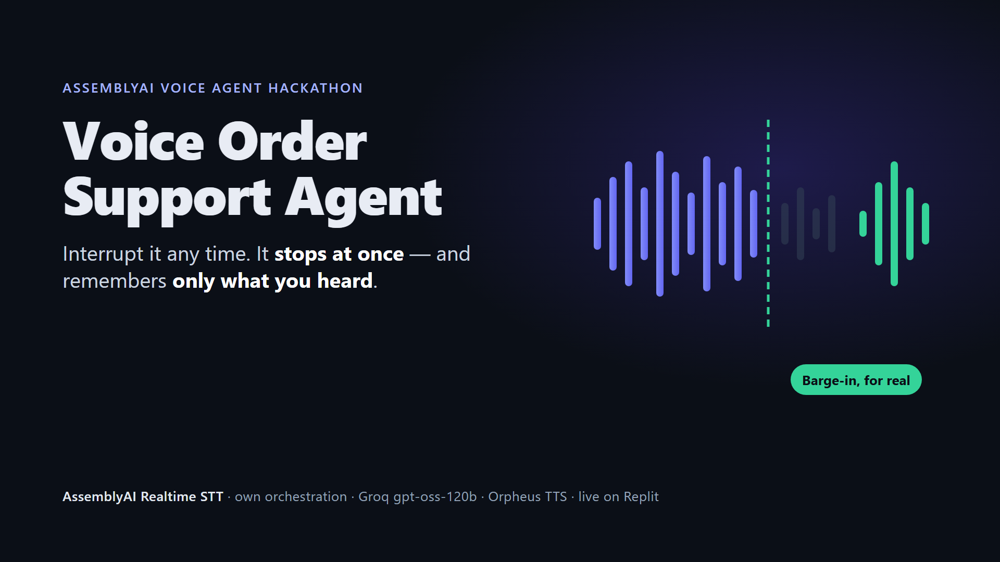

# Voice Order Support Agent

**A voice agent that remembers only what you actually heard.**

Built for the [AssemblyAI Voice Agent Hackathon](https://lablab.ai/ai-hackathons/assemblyai-voice-agent-hackathon)
on the **Realtime Speech-to-Text** path — AssemblyAI's streaming WebSocket with our own
orchestration, LLM and text-to-speech. Not the managed Voice Agent API.

**Try it:** https://voice-order-support-agent--my5757980.replit.app — press Start, ask
where your order is, then talk over the answer.

| | |
|---|---|
| Demo video (1:55) | [`assets/demo.mp4`](assets/demo.mp4) |
| Slides | [`assets/slides.pdf`](assets/slides.pdf) |
| Submission text | [`SUBMISSION.md`](SUBMISSION.md) |

Measured on the recorded run against the deployed app: the agent went silent **1.14 s**
after the shopper started talking over it, and answered **3.0 s** (median) after the
shopper finished. The live demo runs on Groq's free tier — 8,000 model tokens and ten voice
requests a minute — so it serves one conversation at a time.



---

## The idea

Interrupt most voice agents and one of two things happens: they talk over you, or they
stop but keep the words they were saying in their memory. The second failure is quieter
and worse — every following turn is reasoning about a sentence you never heard.

This agent computes what you *actually heard* — from the audio frames the browser's
playback buffer genuinely released, mapped back onto the text that produced them — and
truncates its own memory to that prefix. Not to what the model generated.

The resolution is per clause rather than per character, because the current speech
provider returns no character alignment. That bound is honest and it is still bounded by
audio that actually played, which is the part that matters.

That property is only available because we took the harder path. An agent built on a
managed voice API is handed turn-taking and never sees the seam.

The domain is e-commerce post-purchase support — "where is my order?", returns,
cancellations. The highest-volume, lowest-value contact category in retail, and one the
business can already answer instantly from data it owns.

## What it does

- Identifies your order without asking for a number, and disambiguates by item and date
- Answers status and tracking, and says "it hasn't shipped" rather than inventing a carrier
- Starts returns and cancels orders — **only after reading the action back and hearing you agree**
- Escalates to a human with full context, immediately, whenever asked
- Can be interrupted mid-sentence, and knows the difference between "no wait —" and "mhm"

## What makes it different

| | |
|---|---|
| **Interruption fidelity** | Memory keeps the heard prefix, not the generated text |
| **Backchannels don't interrupt** | "mhm" while it talks is ignored; "yes" answering a confirmation is not |
| **Actions are structurally gated** | `create_return` is unreachable without a confirmed read-back — enforced in the tool registry, not asked for in a prompt |
| **Never claims false success** | A failed tool produces "that did **not** go through", never "done" |
| **Duplicate-proof** | Idempotency is a database `UNIQUE` constraint, so it holds even if the calling logic is wrong |

## Architecture

```
BROWSER                        │  BACKEND (one asyncio task group per session)
                               │
  mic → AudioWorklet ──────────┼──▶ ingest loop ──▶ AssemblyAI v3 WebSocket
     50 ms PCM16 @ 16 kHz      │                         │ Turn events
                               │                         ▼
  playback AudioWorklet ◀──────┼─── Orchestrator ──▶ ToolRegistry ──▶ SQLite
     ring buffer,              │         │              (4 gates)
     zeroed on interrupt       │         ▼
                               │      LLM (streaming) ──▶ clause splitter ──▶ TTS
```

Three design decisions worth knowing:

**Audio is relayed through our backend**, not browser→AssemblyAI direct, even though the
vendor supports the latter. Committed turns authorise memory writes and tool calls,
including "the customer confirmed the return" — an untrusted browser must not be the
authority on what was committed.

**Barge-in fires concurrently, and the client half is the one that matters**: a
`audio.flush` to the browser, cancellation of the turn's task group, and — where the
provider supports it — a server-side stop. Only the client flush silences the ~200 ms
already sitting in the browser's ring buffer. A design that waits for the server to
acknowledge before flushing the client measures a correct-looking interrupt latency while
the agent keeps talking.

**The language model was chosen by measurement, not reputation.** Of four candidates only
`openai/gpt-oss-120b` was both fast and able to emit `tool_calls` — and every tool in this
project depends on tool calling. AssemblyAI's own LLM Gateway was evaluated first, since it
would have needed no extra credential, and rejected on evidence: one model reachable on the
free tier, `"does not support tools"`, and 4.9 s to first token.

## Run it

No API keys required — the whole pipeline runs on scripted LLM and tone-based TTS
against the real tool registry and real seeded data.

```bash
# backend
cd backend && pip install -e ".[dev]" && python -m src.adapters.store.seed
uvicorn src.app:app --port 8000

# frontend, in another terminal
cd frontend && npm install && npm run dev
```

Open <http://localhost:5173>, then type or say **"where's my order?"**

With keys, copy `.env.example` to `.env` and fill in `ASSEMBLYAI_API_KEY` and
`GROQ_API_KEY` — two credentials, since Groq serves both the language model and the
speech synthesis. Each slot switches independently, so an AssemblyAI key alone gives real
transcription with scripted replies. `GET /api/health` reports which mode each slot is in.

## Tests

```bash
cd backend && pytest        # 160 tests, no network, no vendor account
```

Two are worth reading:

- `test_core_purity.py` walks the AST of every module under `core/` and fails on any
  vendor SDK, network or storage import. It has a positive control that proves it can
  fail — a guard never seen failing is indistinguishable from no guard.
- `test_actor.py::test_interruption_truncates_memory_to_what_was_heard` is the property
  this project leads with. If it regresses, the central claim is false.

## Stack

Python 3.11+ / FastAPI · TypeScript / Vite / AudioWorklet · SQLite ·
**AssemblyAI Universal-3.5 Realtime STT** · Groq `openai/gpt-oss-120b` ·
Groq / Canopy Labs Orpheus TTS

The language model adapter is OpenAI-compatible, so Gemini or OpenAI are a `.env` line
away. AssemblyAI is the one pinned vendor — it is the point of the project.

## Project documents

Built spec-first. The reasoning behind every decision is in the repository:

- [`.specify/memory/constitution.md`](.specify/memory/constitution.md) — the
  non-negotiable engineering principles
- [`specs/001-order-support-agent/spec.md`](specs/001-order-support-agent/spec.md) —
  68 requirements, 23 acceptance scenarios
- [`specs/001-order-support-agent/plan.md`](specs/001-order-support-agent/plan.md) —
  architecture and the two at-risk latency budgets
- [`specs/001-order-support-agent/research.md`](specs/001-order-support-agent/research.md) —
  vendor claims marked `[vendor]`, our budgets marked `[ours]`

## Licence

MIT — see [LICENSE](LICENSE).
